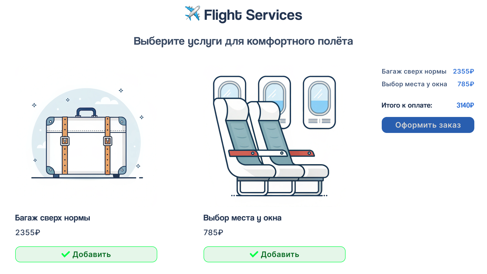

# ✈️ Flight Services: Сервис дополнительных услуг для авиапассажиров

[](https://github.com/DanriWeb/flight-services)
[](https://react.dev/)
[](https://www.typescriptlang.org/)
[](https://vitejs.dev/)

**Flight Services** — интерактивный интерфейс для выбора дополнительных услуг авиапассажирами.

> **ℹ️ О проекте:**
> Пет-проект для демонстрации навыков разработки на современном стеке (React + TypeScript + Vite), работы с состоянием приложения и создания адаптивного интерфейса по принципу mobile-first.

> **🎨 Дизайн:**
> Макет интерфейса разработан в Figma — [**посмотреть дизайн-макет**](https://www.figma.com/design/snqSmHglbixqarSLelBgEL/%C2%ABFlight-Services%C2%BB?node-id=0-1&t=g72HOvJMmBSVl7MD-1)

---

## 📸 Превью приложения



_Интерфейс выбора дополнительных услуг для авиапассажиров_

---

## 🚀 Другие проекты

[](https://github.com/DanriWeb/novveris)
[](https://github.com/DanriWeb/freelance-calculator)

## 📑 Навигация

- [1. Выполненные требования](#1-выполненные-требования)
- [2. Установка и запуск](#2-установка-и-запуск)
- [3. Архитектура проекта](#3-архитектура-проекта)
- [4. Технологический стек](#4-технологический-стек)
- [5. Лицензия](#5-лицензия)
- [6. Контакты](#6-контакты)

---

## 1. Выполненные требования

Проект изначально создавался как тестовое задание для компании **TECCOD** — разработка простого экрана для MVP сервиса дополнительных услуг авиапассажиров.

### Требования задания

**Функциональные:**

- ✅ Страница со списком услуг (моковые данные)
- ✅ Отображение названия, цены и кнопки «Добавить» для каждой услуги
- ✅ Добавление услуг в список выбранных по клику
- ✅ Блок «Итого» с выбранными услугами, общей суммой и кнопкой «Оформить заказ»
- ✅ Адаптивный интерфейс (mobile-first)

**Технические:**

- ✅ React 19 + TypeScript 5
- ✅ Функциональные компоненты с хуками
- ✅ Корректная работа со состоянием (useState)
- ✅ Аккуратная структура кода с разделением на компоненты, типы и данные

---

## 2. Установка и запуск

**Предварительные требования:** Node.js v18+ и npm v9+.

**Клонирование:**

```bash
git clone https://github.com/DanriWeb/flight-services.git
cd flight-services
```

**Установка зависимостей:**

```bash
# npm
npm install

# yarn
yarn install

# pnpm
pnpm install
```

**Запуск приложения:**

```bash
# npm
npm run dev            # запуск в режиме разработки
npm run build          # сборка для продакшена
npm run preview        # предпросмотр продакшен-сборки

# yarn
yarn dev
yarn build
yarn preview

# pnpm
pnpm run dev
pnpm run build
pnpm run preview
```

**Проверка качества кода:**

```bash
# npm
npm run lint           # проверка кода с ESLint

# yarn
yarn lint

# pnpm
pnpm run lint
```

> 💡 **Подсказка:** После запуска `npm run dev` приложение будет доступно по адресу `http://localhost:5173`

---

## 3. Архитектура проекта

Проект использует **компонентную архитектуру** (Component-Based Architecture) с чётким разделением на слои данных, типов, хуков и UI-компонентов.

### Структура файлов

```
src/
├── assets/          # Статические ресурсы (шрифты, иконки, изображения)
├── components/      # React компоненты и их стили
├── hooks/           # Пользовательские хуки
├── types/           # TypeScript типы и интерфейсы
├── data/            # Mock data (моковые данные)
├── App.tsx          # Главный компонент приложения
├── App.css          # Стили приложения
├── index.css        # Глобальные стили и шрифты
└── main.tsx         # Точка входа
```

### Принципы организации

- **Разделение ответственности** — каждый компонент отвечает за свою часть UI
- **Переиспользование** — компоненты независимы и могут использоваться повторно (например, `Button`)
- **Colocation** — CSS файлы находятся рядом с соответствующими компонентами
- **Типизация** — все данные и пропсы строго типизированы через TypeScript
- **Utility Types** — использование `Pick`, `Omit` для переиспользования типов
- **Mock Data** — данные вынесены в отдельный слой для лёгкой замены на API

---

## 4. Технологический стек

| Технология | Версия | Назначение                   |
| ---------- | ------ | ---------------------------- |
| React      | 19.2.0 | Библиотека для построения UI |
| TypeScript | 5.9.3  | Типизированный JavaScript    |
| Vite       | 7.2.4  | Сборщик и dev-сервер         |

---

## 5. Лицензия

Этот проект распространяется под лицензией **MIT**.

---

## 6. Контакты

Я открыт для новых предложений и карьерных возможностей. Если вас заинтересовал мой опыт или у вас есть подходящая вакансия — буду рад обсудить сотрудничество.

Вы можете связаться со мной через следующие каналы:

| Канал связи     | Ссылка / ID                                                                         |
| :-------------- | :---------------------------------------------------------------------------------- |
| **Telegram**    | [**@danriweb_online**](https://t.me/danriweb_online)                                |
| **Email**       | [danri.web@gmail.com](mailto:danri.web@gmail.com)                                   |
| **HeadHunter**  | [Резюме на HeadHunter](https://hh.ru/resume/741ea29dff0f262c1c0039ed1f7730326d694e) |
| **Habr Career** | [Профиль на Хабр Карьере](https://career.habr.com/danriweb)                         |

---

**Дата создания:** Декабрь 2025
